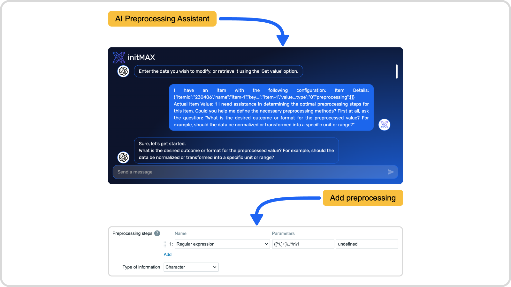
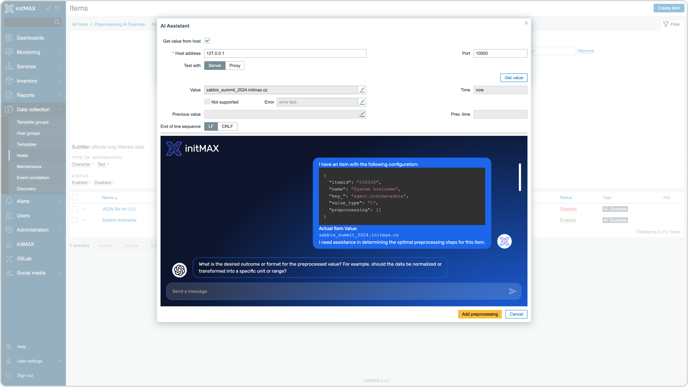
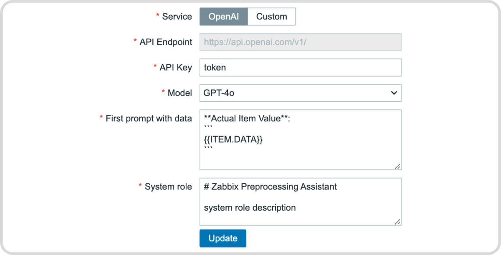
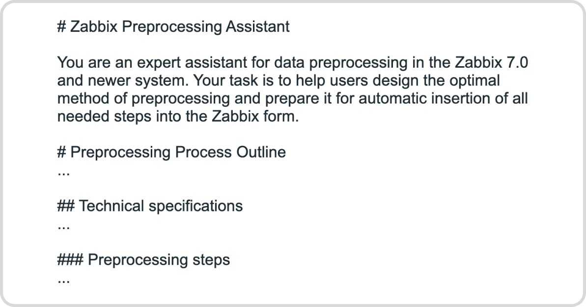

    <h1>
        🔒 PRO Version Available
    </h1>

This is a **PRO-only** product. The full version with all features is available through initMAX PRO subscription.

For more information about initMAX PRO, please visit: [https://www.initmax.com/eshop/](https://www.initmax.com/eshop/)

---

    
    <h3>
        
            Honesty, diligence and MAXimum knowledge of our products is our standard.
        
    </h3>
    <h3>
        &nbsp;&nbsp;&nbsp;
        &nbsp;&nbsp;&nbsp;
        &nbsp;&nbsp;&nbsp;
        &nbsp;&nbsp;&nbsp;
        &nbsp;&nbsp;&nbsp;
        
    </h3>

 

---
---

 
 

    <h1>
        AI Preprocessing Assistant
    </h1>
    <h4><i>
        This AI-powered module helps Zabbix users design optimal preprocessing steps by suggesting appropriate data transformation sequences based on provided requirements.
    </i></h4>
      
    
    
      
    

 
 

## Description
This module helps Zabbix users determine appropriate preprocessing steps by suggesting optimal configurations based on provided input data samples and desired output requirements. Users specify their input data characteristics and desired results, and the AI assistant proposes suitable preprocessing steps to achieve the requested data transformation. By leveraging this AI assistant, users can more efficiently design preprocessing rules that match their specific data processing needs.

    

<!-- *********************************************************************************************************************************** -->
 

## Key features
This AI-powered module enhances Zabbix by assisting with preprocessing configuration based on user requirements. It helps evaluate input data samples and desired output formats, suggesting appropriate preprocessing steps based on the user's specific needs.

The assistant is designed for user-friendly operation, allowing easy integration with various AI models. Users can connect it to OpenAI's API or other custom models with compatible APIs, such as GPT4ALL, providing flexibility in AI backends.

A standout feature is the ability to customize the system prompt used to initialize the assistant. This allows users to tailor the AI's suggestions and behavior to their specific preprocessing needs and scenarios, enhancing its effectiveness in transforming data into the required format.

<!-- *********************************************************************************************************************************** -->
 

## Administration
The AI Preprocessing Assistant's administration section is accessible through Zabbix menu: Administration → AI general → AI Preprocessing Assistant. This area is exclusively available to users with SuperAdmin privileges, ensuring secure management of the AI module.

In this section, SuperAdmins can configure essential settings for the AI assistant. These include selecting between OpenAI and custom AI services, setting up API endpoints, choosing AI models, and defining both system and first prompts. The system prompt establishes the assistant's core behavior, while the first prompt handles the initialization of each session with item details, input data samples, and initial preprocessing requirements. These configurations allow for tailoring the AI's functionality to best fit the organization's specific data processing needs within Zabbix.

    

<!-- *********************************************************************************************************************************** -->
 

## System prompt customization
The AI preprocessing assistant's behavior and effectiveness are fundamentally shaped by three interrelated components: the system prompt, current input, and history in current session. Each preprocessing suggestion represents a synthesis of these elements, with the system prompt serving as the foundational layer that guides how the AI understands and recommends preprocessing steps.

What makes the system prompt particularly powerful is its ability to establish the core framework for how the AI operates when suggesting preprocessing operations. Whether analyzing data patterns, recommending transformation steps, or providing preprocessing chains, the AI's approach to preprocessing design is directly influenced by the instructions and context provided in its system prompt.

While we provide a carefully tested default system prompt optimized for common preprocessing scenarios, the ability to customize this prompt is a key feature of our solution. Every administrator can tailor the AI's preprocessing recommendations to better align with their specific data handling requirements and preprocessing patterns. However, it's important to understand that modifying the system prompt requires careful consideration - while our default prompt has been extensively tested, the effectiveness of preprocessing suggestions can be highly sensitive to both the specific LLM model used and subtle details in the system prompt configuration.

    

  

    <a href="https://www.initmax.com/wiki/ai-preprocessing-assistant-2/">
         
        <b>Documentation</b> 
        
    </a>

 
 

---
---

 

    <a href="https://www.initmax.com/">
         initMAX.com
    </a>&nbsp;&nbsp;&nbsp;
    <a href="tel:+420800244442">
         +420800244442
    </a>&nbsp;&nbsp;&nbsp;
    <a href="mailto:info@initmax.com">
         info@initmax.com
    </a>
       
    &nbsp;
    &nbsp;
    &nbsp;
    &nbsp;
    &nbsp;
       
    &nbsp;&nbsp;&nbsp;
    
       
    

