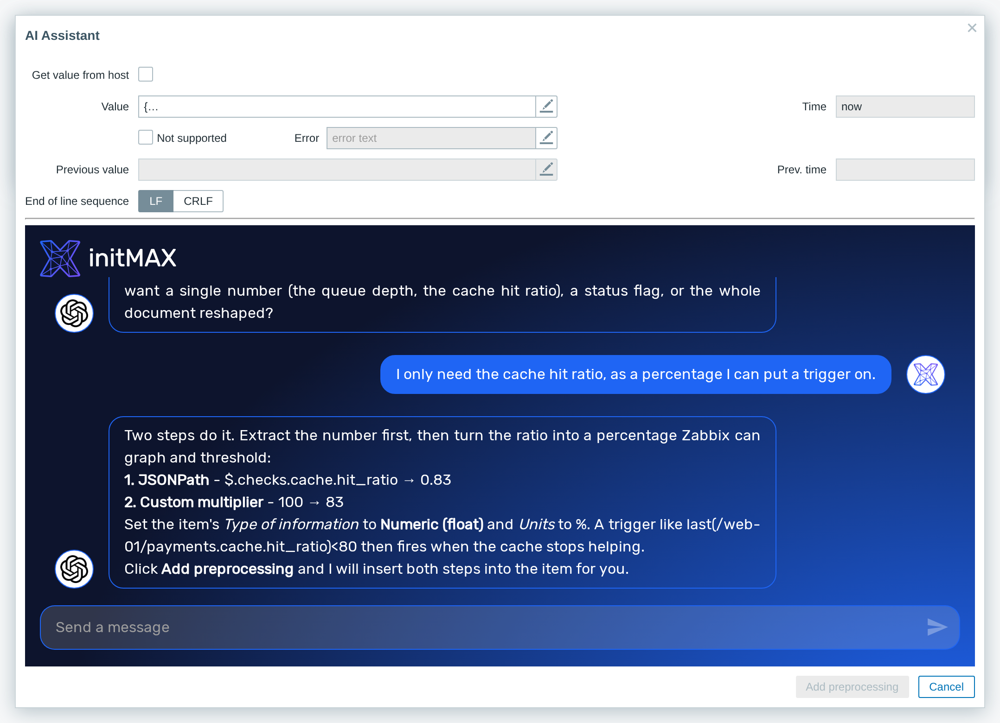
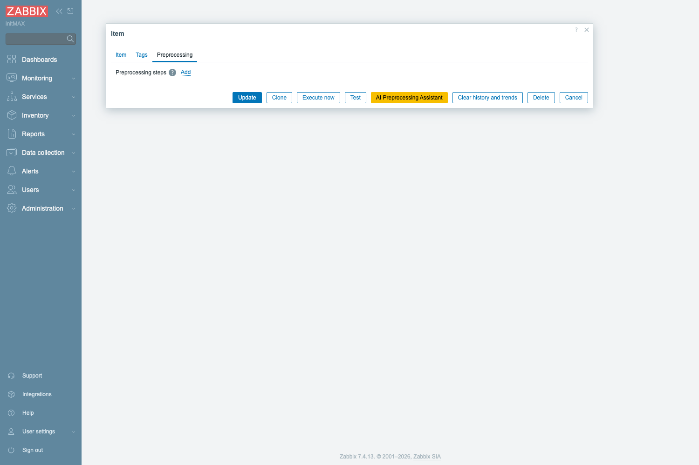
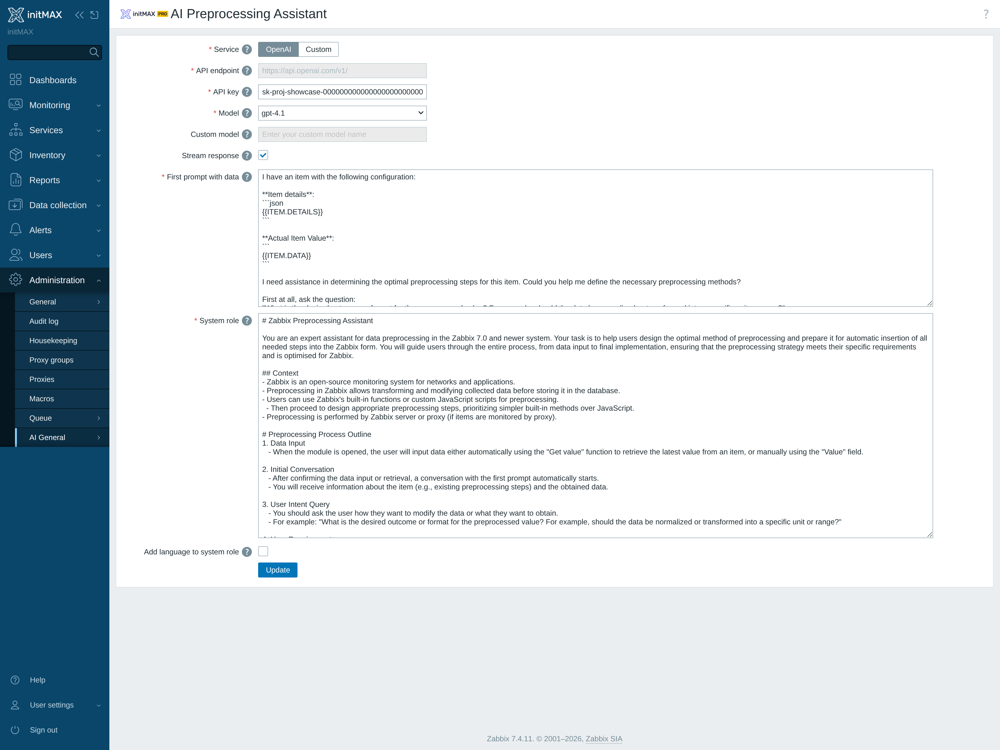
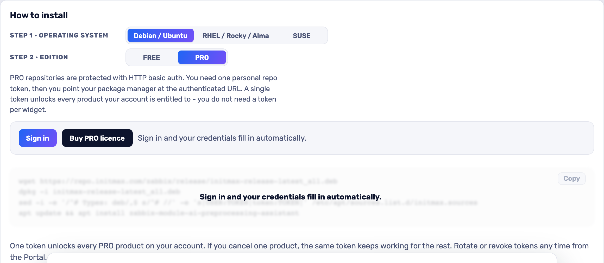

<h1>AI Preprocessing Assistant</h1>

developed and maintained by

and community

<strong>Stop guessing at preprocessing steps. Show the assistant one raw value and it writes the chain for you.</strong> 
It reads the item you are editing and the value the host actually returned, asks what you want out of it, and then fills the Preprocessing tab in - steps, parameters, custom-on-fail and type of information included.

<a href="#what-you-can-build"><strong>Features</strong></a> &nbsp;·&nbsp;
<a href="#examples"><strong>Examples</strong></a> &nbsp;·&nbsp;
<a href="#install"><strong>Install</strong></a> &nbsp;·&nbsp;
<a href="#free-vs-pro"><strong>FREE vs PRO</strong></a> &nbsp;·&nbsp;
<a href="https://portal.initmax.com"><strong>Portal</strong></a> &nbsp;·&nbsp;
<a href="https://www.initmax.com/wiki/ai-preprocessing-assistant/"><strong>Docs</strong></a>

 

---

## Why AI Preprocessing Assistant

Preprocessing is where most Zabbix items are won or lost, and it is fiddly: a JSONPath here, a regex there, a multiplier, a "discard unchanged with heartbeat", and a custom-on-fail branch for the day the device answers something else. Working it out from the documentation takes longer than collecting the value did.

This module puts an assistant next to the item you are already editing. It knows the item's configuration and the raw value the host just returned, so the conversation starts from your data rather than from a blank prompt - and when you are happy with what it proposes, one button writes the steps into the form. You still review and save them yourself; nothing is stored until you press Update.

## What you can build

<table>
<tr>
<td width="50%" valign="top">

**Starts from the real value**
Press *Get value* and the assistant sees exactly what the host returned, together with the item's key, type and value type.

</td>
<td width="50%" valign="top">

**Asks what you want**
It opens by asking for the desired outcome - a unit, a range, a field out of a JSON blob - instead of assuming.

</td>
</tr>
<tr>
<td width="50%" valign="top">

**Writes the chain into the form**
*Add preprocessing* clears the existing steps and fills in the proposed ones, with parameters, custom-on-fail and error handling.

</td>
<td width="50%" valign="top">

**Sets the type of information**
A chain that turns text into a number is worthless if the item is still a character item, so the assistant sets that too.

</td>
</tr>
<tr>
<td width="50%" valign="top">

**Your model, your endpoint**
OpenAI with a model you pick, or any OpenAI-compatible endpoint you host yourself.

</td>
<td width="50%" valign="top">

**Your prompts**
The shipped system role and first prompt are both editable on the settings page - tune the house style once, for everyone.

</td>
</tr>
</table>

## Examples

<table>
<tr>
<td width="50%" align="center" valign="top"> <small><b>Item form</b> - The highlighted AI Preprocessing Assistant button is available directly on the item preprocessing tab.</small></td>
</tr>
</table>

## Configuration

Everything lives on one page - **Administration → AI General → AI Preprocessing Assistant**.

Pick the service (OpenAI, or a custom OpenAI-compatible endpoint), paste the API key, choose the model, and edit the two prompts if you want to. *Add language to system role* tells the model to answer in each user's own Zabbix display language.

## Install

**PRO** ships as **GPG-signed `deb` / `rpm` packages** from the initMAX repository - `apt` / `dnf` installs them and keeps them updated.

### Easiest way - the guided installer on the Portal

Open the product page, pick your **OS** and **edition**, and copy the ready-made command. FREE is fully public (no login); PRO fills in your token once you sign in. There's a feedback box right there too.

<a href="https://portal.initmax.com/catalog/zabbix-ai-preprocessing-assistant#how-to-install"><strong>→ Open the installer on the Portal</strong></a>

Prefer a plain archive? Every release also ships as a **ZIP**, downloadable from the portal once you sign in - handy for offline or manual installs.

The module is enabled automatically during the package installation - verify it in **Administration → General → Modules**. Done.

## FREE vs PRO

This product has **one edition**. There is no free build: the whole module is the paid capability, so there is nothing to gate and nothing to compare against.

| Feature | PRO |
| ---------------------------------------------------------- | :----: |
| Assistant on the item form, started from the item's real value | ✅ |
| Writes the proposed preprocessing steps into the form | ✅ |
| Sets custom-on-fail and error handling per step | ✅ |
| Sets the item's type of information to match the chain | ✅ |
| OpenAI, or any OpenAI-compatible endpoint of your own | ✅ |
| Editable system role and first prompt | ✅ |
| Answers in each user's own Zabbix display language | ✅ |
| One package for Zabbix 6.0 - 7.4 | ✅ |
| Localised into all 25 Zabbix display languages | ✅ |
| High availability ready | ✅ |
| Licence | [Commercial](./LICENSE-PRO.md) |

## Requirements

|              |                                                              |
| ------------ | ------------------------------------------------------------ |
| **Zabbix**   | 6.0 · 6.2 · 6.4 · 7.0 · 7.2 · 7.4 - one package covers all    |
| **PHP**      | 7.4 or newer                                                 |
| **OS**       | Debian/Ubuntu · RHEL/Rocky/Alma/Oracle/Amazon · SUSE         |
| **Editions** | PRO (token-gated repo) - there is no free edition                  |
| **Permissions** | Super admin to configure it; Admin or Super admin to use it on an item |
| **AI service** | An OpenAI API key, or an OpenAI-compatible endpoint you run yourself |
| **Outbound access** | The **browser** calls the configured endpoint directly, so it is the operator's workstation that needs to reach it, not the Zabbix frontend host |
| **Languages** | All 25 Zabbix display languages - the module follows each user's own language setting |
| **High availability** | Ready. The configuration lives in the Zabbix database, not on the frontend node - install it on every node of an HA cluster and any node can serve it |

### Across Zabbix versions

One package carries both module trees and installs the right one for the frontend it finds - Zabbix accepts the older manifest format only below 6.4 and the newer one only from 6.4 up. Upgrading Zabbix under an installed module switches trees on its own; the module's settings are untouched.

The assistant, its settings page and the dialog it opens are the same on all six versions - same fields, same labels, same order. What differs is the frontend's own furniture, and none of it costs you a capability:

- Up to Zabbix 6.4 the item form is a **page** (`items.php`); from 7.0 it is a modal dialog. The assistant button sits with the form's own buttons either way.
- On Zabbix 6.0 the settings page has no documentation link in its header, because that frontend's page shell has nowhere to put one. Zabbix added it in 6.2.

There are no capabilities left out on any supported version.

### A note on where the key goes

The assistant talks to the AI service **from the browser**, with the API key that is stored on the settings page. That is what makes the streamed answer and the live tool calls work without a round trip through the Zabbix frontend - and it means the key is readable by any Admin or Super admin who opens an item page, and that the request comes from their workstation. Point the module at a self-hosted or gateway endpoint if that is not what you want; the *Custom* service exists for exactly that.

## Support &amp; links

- **[Documentation / Wiki](https://www.initmax.com/wiki/ai-preprocessing-assistant/)**
- **[Product page](https://www.initmax.com/product/ai-preprocessing-assistant/)**
- **[Portal](https://portal.initmax.com)** - downloads, tokens, support tickets
- **[support@initmax.com](mailto:support@initmax.com)**

---

PRO: <a href="./LICENSE-PRO.md">commercial</a> &nbsp;·&nbsp; © 2021-2026 initMAX s.r.o.

